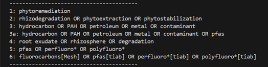

# python-portfolio-project-phytoremediation-data-mining-tool

This project is designed to help a team of researchers find relevant scientific papers in furtherance of a specific research objective: identifying plant species that fulfill diverse contaminant remediation roles in nature. 

Some of the papers found using this tool could be used as citations to support the primary research goal, the main thrust of which is to perform DNA analysis and document phylogenetic links among these plants. Finding relevant species *a priori* is an important element of the team’s work.

The search mechanism employed in the code is the NCBI1 Entrez search engine. Entrez `esearch` and `efetch` programming utilities are invoked, and `esearch` is specifically directed to retrieve unique IDs from PubMed2 for this project. 

Program execution is driven via user prompts. The user may choose to enter a single species name, or multiple species assembled ahead of time in an external file: `speciies_list`.txt. From here, the user need only select a prescribed search criteria to generate an output list of journal abstracts: `abstracts.txt`.

  

Figure 1. The List of User Search Criteria Options

The search options from figure 1 are combined with a plant species of interest using logical AND.

- Option 1 - the overarching term:3
    `phytoremediation`
- Option 2 - by sub-mechanism; in the soil, through absorption and removal, or containment:
    `rhizodegradation OR phytoextraction OR phytostabilization`
- Option 3 - via environmental pollutant hierarchy:
    `hydrocarbon OR PAH OR petroleum OR metal OR contaminant`
- Option 3a - as above, but also including PFAS:
    `hydrocarbon OR PAH OR petroleum OR metal OR contaminant OR pfas`
- Option 4 - by biological location, chemical cocktail, or degree of mineralization:
    `root exudate OR rhizosphere OR degradation`
- Option 5 - PFAS and PFA substance prefixes:
    `pfas OR perfluoro* OR polyfluoro*`
- Option 6 - as above with title and abstract field restrictions, and also including older taxonomy for what are now often referred to colloquially as “forever chemicals”. The Medical Subject Headings term fluorocarbons is included in many foundational toxicology and environmental engineering studies. Including it here may reduce the likelihood of missing species-related findings from important earlier work.
    `fluorocarbons[Mesh] OR pfas[tiab] OR perfluoro*[tiab] OR polyfluoro*[tiab]`

Once a search choice is made, the code will create a subdirectory and populate it with a file containing an enumerated abstract listing. The file also provides for the user a timestamp (`datetime` object), an abstract count, and an elapsed time metric for the search. Subsequent code execution will overwrite and replace the search results.

In order to run successfully, the script.py file, lib.py (helper function), and species_list.txt should be cloned and run together. For convenience, a small species list is included to get you started as you execute the code in VSCode, PyCharm or other preferred IDE. This code was developed using **Python 3.14.3** and **VS Code v1.127.0**  The project was built and verified on the **Windows 11 Home (25H2)** operating system.

## ⚠️ Important Warnings ⚠️
    - As noted above, subsequent executions of script.py will overwrite and replace any prior search results. Keep this in mind, particularly when curating the results of exceptionally large and time-consuming searches.
    - NCBI employs rate limits that will block access if more that 3 requests per second are made without the use of an API key. Obtaining and including an API key through code modification is not difficult. Establish an NCBI login account to obtain a key in case this becomes an issue.

The programmer has also used this coding project as an opportunity to learn how the Entrez E-Utilities work, and how best to leverage these tools. Despite the popularity of open source utilities often used in tandem with Entrez, such as Biopython, these were not used here so that the Entrez E-Utilities APIs could be directly manipulated. A future version is planned where modules such as `Bio.Entrez` will be used to streamline automation of this pipeline.

The MIT License is used for this project. 

1**NCBI**: National Center for Biotechnology Information, a division of the National Institutes of Health (NIH).

2**PubMed** is a biomedical literature citation database maintained by NCBI. It is primarily populated with entries from the US National Library of Medicine (also known as MEDLINE) which is a rigorously reviewed bibliographic database.

3**Phytoremediation** is a compound word that is commonly used when indexing and cross-referencing scientific literature. The word combines the concept of *remediation* with the Greek root *-Phyto*, meaning “Plant” or “that which has grown.”
